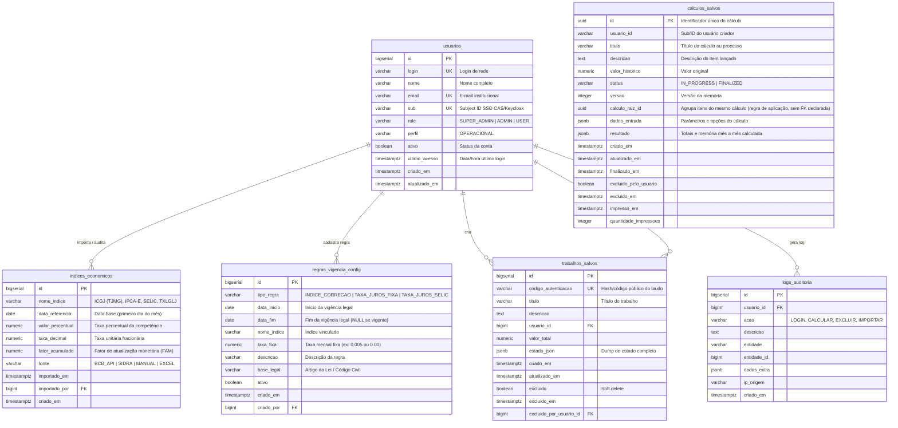

# Modelo de Entidade e Relacionamento (ER) - SISCALC
**Sistema de Atualização Monetária e Juros - CEAT / MPMG**  
**Arquivo de Referência DDL:** [`schema_completo.sql`](file:///c:/Users/msgsilva.plansul/Desktop/atualizacao-monetaria/Tabelas_Banco_PostgreSQL/schema_completo.sql)  
**Banco de Dados:** PostgreSQL (`db_AtualizacaoMonetaria`)

---

## 1. Diagrama Entidade-Relacionamento (Mermaid)

---

## 2. Dicionário de Dados e Estrutura das Tabelas

### 2.1. `usuarios`
Responsável pelo controle de acesso, perfis (RBAC) e sincronização do Single Sign-On (SSO) do MPMG via CAS / Keycloak.
* **Chave Primária:** `id` (`BIGSERIAL`).
* **Chaves Únicas:** `login`, `email`, `sub`.
* **Principais Campos:**
  * `sub`: Identificador universal do usuário provido pelo CAS/Keycloak.
  * `role`: Perfil de privilégios (`SUPER_ADMIN`, `ADMIN`, `USER`).
  * `perfil`: Nível funcional (`OPERACIONAL`).

### 2.2. `indices_economicos`
Tabela mestra de taxas e fatores econômicos mensais/diários.
* **Chave Primária:** `id` (`BIGSERIAL`).
* **Chave Única Composta:** `(nome_indice, data_referencia)` — impede duplicações em sincronizações idempotentes.
* **Chave Estrangeira:** `importado_por` $\rightarrow$ `usuarios(id)` (`ON DELETE SET NULL`).
* **Principais Índices e Séries:**
  * `ICGJ (TJMG)`: Tabela Prática da Corregedoria do TJMG (importada via planilha oficial Excel).
  * `IPCA-E`: Índice de Preços ao Consumidor Amplo Especial (SGS 10764 / SIDRA).
  * `SELIC`: Taxa do Sistema Especial de Liquidação e Custódia (SGS 4390 mensal e série 11 diária).
  * `TXLGLJ`: Taxa Legal da Lei 14.905/2024 (SGS 29543).

### 2.3. `regras_vigencia_config`
Configurações parametrizáveis das leis e vigências temporais do Código Civil Brasileiro e Lei nº 14.905/2024.
* **Chave Primária:** `id` (`BIGSERIAL`).
* **Chave Estrangeira:** `criado_por` $\rightarrow$ `usuarios(id)`.
* **Carga Inicial (Seeds vigentes):**
  * `ID 1`: 0,5% ao mês (Art. 1.062 do CC/1916) até `10/01/2003`.
  * `ID 2`: 1,0% ao mês (Art. 406 do CC/2002) de `11/01/2003` até `29/08/2024`.
  * `ID 3`: Taxa Legal (Lei nº 14.905/2024) a partir de `30/08/2024`.
  * `ID 4`: INPC/ICGJ como índice monetário até `31/08/2024`.
  * `ID 5`: IPCA como índice monetário a partir de `01/09/2024`.

### 2.4. `calculos_salvos`
Tabela principal do aplicativo web SISCALC (SvelteKit + FastAPI).
* **Chave Primária:** `id` (`UUID` padrão `gen_random_uuid()`).
* **Agrupamento via `calculo_raiz_id` (`UUID`):** Campo utilizado pela **aplicação** para vincular diferentes lançamentos/itens a um mesmo cálculo unificado. **Não é uma `FOREIGN KEY` declarada no DDL** — a integridade é garantida por regra de negócio no backend (FastAPI), não pelo banco.
* **Campos em JSONB:**
  * `dados_entrada`: Armazena datas, pro-rata, opções de juros e parâmetros informados pelo perito.
  * `resultado`: Armazena o fator calculado, valores intermediários e a memória analítica completa mês a mês.
* **Auditoria de Ciclo de Vida:**
  * `status`: `IN_PROGRESS` (em andamento) ou `FINALIZED` (bloqueado para conferência e emissão).
  * `excluido_pelo_usuario`: Soft delete lógico.

### 2.5. `trabalhos_salvos`
Armazenamento consolidado de trabalhos e laudos periciais com código de validação pública.
* **Chave Primária:** `id` (`BIGSERIAL`).
* **Chave Única:** `codigo_autenticacao` (`VARCHAR(50)`).
* **Chaves Estrangeiras:** `usuario_id`, `excluido_por_usuario_id` $\rightarrow$ `usuarios(id)`.

### 2.6. `logs_auditoria`
Rastreamento de ações administrativas e operacionais para conformidade e segurança da informação.
* **Chave Primária:** `id` (`BIGSERIAL`).
* **Chave Estrangeira:** `usuario_id` $\rightarrow$ `usuarios(id)`.
* **Campos:** `acao`, `descricao`, `entidade`, `entidade_id`, `dados_extra` (JSONB), `ip_origem`.

---

## 3. Índices de Desempenho

> **Nota:** Campos declarados com `UNIQUE` no DDL já possuem índice B-tree criado automaticamente pelo PostgreSQL. Abaixo estão listados apenas os índices **explicitamente criados** via `CREATE INDEX` no DDL.

| Tabela | Índice (DDL) | Campos | Finalidade |
| :--- | :--- | :--- | :--- |
| `usuarios` | `idx_usuarios_email` | `email` | Busca rápida no login (explícito no DDL, redundante com UNIQUE) |
| `usuarios` | `idx_usuarios_sub` | `sub` | Autenticação SSO CAS (explícito no DDL, redundante com UNIQUE) |
| `indices_economicos` | `idx_indices_busca` | `nome_indice, data_referencia` | Consulta de séries no cálculo do motor |
| `regras_vigencia_config` | `idx_regras_vigencia` | `tipo_regra, data_inicio, data_fim` (WHERE ativo=TRUE) | Busca da regra legal vigente na data |
| `calculos_salvos` | `idx_calculos_salvos_usuario` | `usuario_id, status` | Listagem da tela inicial "Meus Cálculos" |
| `calculos_salvos` | `idx_calculos_salvos_raiz` | `calculo_raiz_id` | Agrupamento de itens do mesmo cálculo |

### Índices automáticos (gerados por constraints UNIQUE — sem `CREATE INDEX` explícito no DDL)

| Tabela | Campo(s) | Observação |
| :--- | :--- | :--- |
| `usuarios` | `login` | Índice B-tree criado automaticamente pela constraint `UNIQUE` |
| `indices_economicos` | `(nome_indice, data_referencia)` | Índice automático da constraint `UNIQUE` composta |
| `trabalhos_salvos` | `codigo_autenticacao` | Índice automático da constraint `UNIQUE` |
